# 🌿 Kerala Ayurveda AI: RAG & Agentic Safety System

> **A robust AI System designed to bridge the gap between structured medical safety constraints and unstructured educational content.**

[](https://opensource.org/licenses/MIT)
[](https://www.python.org/)
[](./rag_system_design_part_a.md)

---

## 📖 Project Overview

This project simulates a **Retrieval-Augmented Generation (RAG)** pipeline and an **Agentic Workflow** built for **Kerala Ayurveda**. 

The core challenge addressed here is **Safety**: How do we use LLMs to talk about traditional herbs while strictly adhering to medical contraindications (e.g., Pregnancy, Thyroid issues) located in a structured Product Catalog?

### 🌟 Key Features

*   **🛡️ Safety-First RAG**: Hybrid retrieval that prioritizes structured product data (`csv`) to block unsafe answers *before* generation.
*   **🤖 Agentic Fact-Checker**: An autonomous pipeline that audits content drafts for "Vegan" vs "Non-Vegan" claims and illegal "Miracle Cure" language.
*   **⚖️ Tone Guardrails**: Automated scoring system to ensure content aligns with the brand's "Grounded & Precise" voice.

---

## 🏗️ Architecture

### Part A: The RAG Safety Pipeline
We use a **Hybrid Chunking Strategy** to keep the "Contraindications" field attached to the Product ID.

```mermaid
flowchart LR
    UserQUERY["User: 'Can I take Ashwagandha with Thyroid issues?'"]
    
    subgraph Retrieval
        CSV[(Product Catalog CSV)]
        MD[(Markdown FAQs)]
    end
    
    subgraph "Safety Guardrail (Critical)"
        Logic{"Safety Check"}
        CSV -->|Contraindications: 'Thyroid Caution'| Logic
    end
    
    UserQUERY --> Logic
    Logic -- "Risk Detected" --> BLOCK["⛔ BLOCKED REQUEST"]
    Logic -- "No Risk" --> LLM["✅ Generate Answer"]
```



### Part B: The Agentic Workflow
A multi-step chain to generate and verify content.


---

## 🚀 Getting Started

### 1. Prerequisites
*   Python 3.8+
*   `pandas`

### 2. Installation
```bash
git clone https://github.com/architpr/kerala_ayurveda.git
cd kerala_ayurveda
python -m venv venv
# Windows:
.\venv\Scripts\activate
# Mac/Linux:
source venv/bin/activate

pip install -r requirements.txt
```

---

## ⚡ Usage & Simulations

We have built specific scripts to demonstrate the safety logic in action.

### 🧪 Simulation 1: RAG Safety Guardrail
Test the system's ability to **block** a query when a user has a contraindication.

```bash
python run_rag_simulation_part_a.py
```
<details>
<summary><b>👀 View Expected Output</b> (Click to Expand)</summary>

```text
User Query: "Can I take Ashwagandha if I have thyroid issues?"

[System] Retrieved Product: KA-P002 - Ashwagandha Stress Balance Tablets
[System] Database Contraindications: "Caution in thyroid/autoimmune conditions..."

[SAFETY GUARDRAIL] BLOCKED: Risk detected -> ['thyroid']
[Response]: "I cannot recommend this specifically because you mentioned conditions..."
```
</details>

### 🧪 Simulation 2: Agentic Fact Checker
Test the Agent's ability to catch hallucinated "Vegan" claims or "Safe for everyone" errors.

```bash
python run_safety_checker_part_b.py
```
<details>
<summary><b>👀 View Expected Output</b> (Click to Expand)</summary>

```text
--- TEST CASE 1: UNSAFE DRAFT ---
Draft: "This Ashwagandha supplement is a miracle cure... safe for everyone..."

❌ ISSUES FOUND:
  - [SAFETY ERROR] Draft claims 'Safe for everyone', but catalog lists contraindications...
```
</details>

---

## 📂 File Structure

| File | Description |
| :--- | :--- |
| `run_rag_simulation_part_a.py` | **Main Script**: Simulates the RAG retrieval and safety logic. |
| `run_safety_checker_part_b.py` | **Main Script**: Simulates the Agentic validation logic. |
| `products_catalog.csv` | **Data**: The Source of Truth for product safety. |
| `rag_system_design_part_a.md` | **Doc**: Full design specs for the RAG system. |
| `agentic_workflow_design_part_b.md` | **Doc**: Full design specs for the Agent workflow. |
| `content_style_and_tone_guide.md` | **Doc**: Brand voice guidelines used by the Agent. |

---

## 🧠 Design Reflection

> *"The unified challenge was reconciling the rigid constraints of a medical CSV with the fluidity of generative text. We chose to hard-code safety logic rather than relying on the LLM to 'reason' about safety, ensuring deterministic reliability."*

[Read full reflection notes ->](./reflection_step_2.md)
