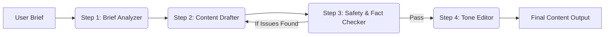

# Agentic Workflow Design (Part B) - Kerala Ayurveda

## 1. Agent Graph Architecture

We propose a sequential **4-Step Agentic Workflow** to ensure strict adherence to safety, accuracy, and brand voice.

### Step 1: Brief Analyzer
*   **Role**: Parsing the raw request into structured metadata.
*   **Input**: "Write a blog post about Ashwagandha for young professionals."
*   **Output JSON**:
    *   `Topic`: "Ashwagandha"
    *   `Target Audience`: "Young Professionals"
    *   `Tone`: "Energizing but grounded"
    *   `Format`: "Blog Post"

### Step 2: Content Drafter
*   **Role**: Generates the initial content using RAG (Retrieval Augmented Generation).
*   **Action**: Retrieves relevant product context (e.g., `KA-P002`) and Foundation MDs, then writes the draft.

### Step 3: Safety & Fact Checker (The Guardrail)
*   **Role**: Validates claims against the **Structured Product Catalog (`products_catalog.csv`)**.
*   **Logic**:
    1.  **Animal Products Check**:
        *   *If* Draft mentions "Vegan" or "Plant-based":
        *   *Check* `products_catalog.csv` column `contains_animal_products`.
        *   *If* column == "Yes": **FLAG ERROR**.
    2.  **Contraindication Check**:
        *   *If* Draft suggests "Safe for everyone":
        *   *Check* `products_catalog.csv` column `contraindications_short`.
        *   *If* column is not empty: **FLAG ERROR** (Must include specific warning).
    3.  **Ingredient Verification**:
        *   *If* Draft mentions an ingredient not in `key_herbs`: **FLAG WARNING** (Hallucination risk).

### Step 4: Tone Editor
*   **Role**: stylistic alignment with `content_style_and_tone_guide.md`.
*   **Logic**:
    1.  **Negative Phrase Matching**: Scan text for forbidden phrases found in the Style Guide under "Phrases that do not sound like us" (e.g., "miracle cure", "guaranteed results", "100% safe").
    2.  **Positive Phrase Reinforcement**: Ensure presence of brand phrases (e.g., "gentle support", "traditionally used").
    3.  **Person-First Language**: Detect "diabetics" -> Replace with "people living with diabetes".

---

## 2. Evaluation Strategy

### A. Tone Adherence Score
We will calculate a deterministic score (0-100) to measure brand alignment.

**Formula**:
`Score = (Base 100) - (Hard Constraint Violations * 20) + (Golden Phrase Bonus * 5)`

*   **Hard Constraint Violation**: usage of forbidden words ("miracle", "cure", "guaranteed").
*   **Golden Phrase Bonus**: usage of "traditionally used", "supports", "may help".
*   *Max score capped at 100.*

### B. Golden Set (Evaluation Dataset)

| Category | Bad Input (Draft) | Corrected Output (Tone Editor) | Reason for Correction |
|Text|Text|Text|Text|
|---|---|---|---|
| **Tone** | "This absolute miracle cure will fix your anxiety instantly." | "This formulation is traditionally used in Ayurveda to gently support the body's stress response." | "Miracle cure" is forbidden. Replaced with "traditionally used" and "support". |
| **Safety** | "Triphala is 100% safe for absolutely everyone to take daily." | "Triphala is generally well-tolerated, but pregnant individuals or those on medication should consult a doctor." | "100% safe" is factually incorrect and dangerous against the Style Guide boundaries. |
| **Fact** | "Our Brahmi Oil is a vegan scalp treatment." | "Our Brahmi Oil is a traditional herbal oil preparation." | Cross-referencing `KA-P003` might show milk/dairy in processing (hypothetically) - ensure we don't label non-vegan products as vegan without verifying `contains_animal_products`. |

---

## 3. Prioritization (Product Thinking)

### What to Ship in Week 1-2 (MVP)
**Focus**: **Safety & Fact Checker Pipeline**.
*   **Why**: In the medical/wellness domain, safety errors (recommending contraindications) or legal liabilities (claiming "cures") are existential risks. A chatbot that has the wrong tone is annoying; a chatbot that hurts a patient is a disaster.
*   **Deliverable**: A robust Python implementation of `Step 3` that parses the CSV and blocks/flags drafts that fail the logic check (Vegan check, Contraindication check).

### What to Postpone
**Postpone**: **Personalization & Complex Multi-turn History**.
*   **Why**:
    1.  **Complexity**: Managing long conversational memory adds significant engineering overhead (vector stores for memory, session management).
    2.  **Value**: The core value proposition is *accurate, brand-safe content generation*. Personalization ("Hi John, based on your last purchase...") is a "Delighter" feature, not a core functional requirement for the internal tool's first version.
    3.  **Data Privacy**: Handling specific user data requires stricter PII controls, which slows down initial development.
